# A technical description 
## of the VATEUD PTD application

*by __Svilen Vassilev__, VATEUD7, Web Services Director*

## Introduction
The VATEUD PTD application consists of a public frontend, available on [ptd.vateud.net](http://ptd.vateud.net/) and
a restricted backend at [ptd.vateud.net/admin](http://ptd.vateud.net/admin). The bulk of the action,
all trainee management, record editing and housekeeping duties take place in the backend.

## Backend

### Authentication
The backend access to the application, available for administrators PTD staff, instructors and examiners
is gated by an authentication system. New backend user records can only be created by existing app admins,
sign up is not possible, password reset tool is provided. Passwords are stored as a random-salted
SHA1 hash. No sensitive data is stored in plain text.

### User roles
Users can have __one or many__ backend roles. The role determines the set of permissions a user has.
The currently existing roles are:

* __Admin__: has full management access to the entire backend and all data types and records
* __Examiner__: has read only access to the all data types. Has full management access to the "Examination" records. Can update existing pilot records for non-upgraded pilots.
* __Instructor__: has read only access to the all data types. Has full management access to the "Trainings" records. Can update existing pilot records for non-upgraded pilots.

A user __without any defined role__ has read-only access to the entire backend.

Note: It's perfectly possible to combine several roles to one user, so for example a single user
can be both an instructor and an examiner, which would grant him the combined privileges
of both these roles.

### Dashboard
The dashboard is the starting place for admins and managers and lists a summary of all currently existing record types. The navigation menu on the left allows switching between the available record types.

### Record management actions
The following common principles apply across the entire app:

For each __record type__ there are several action tabs:

* __List / Index__: a paginated table overview of all available individual records for that type, including links/buttons
  to individual record actions. Below is an example of the pilot trainees listing:
  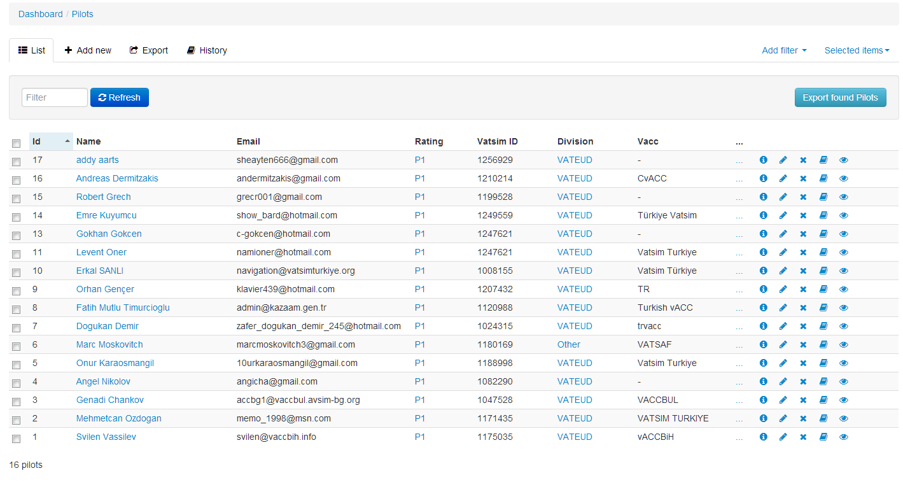
* __Add new__ tab: a form for adding another individual record of the relevant type. Below is an example
  of the "Add new examination" form:
  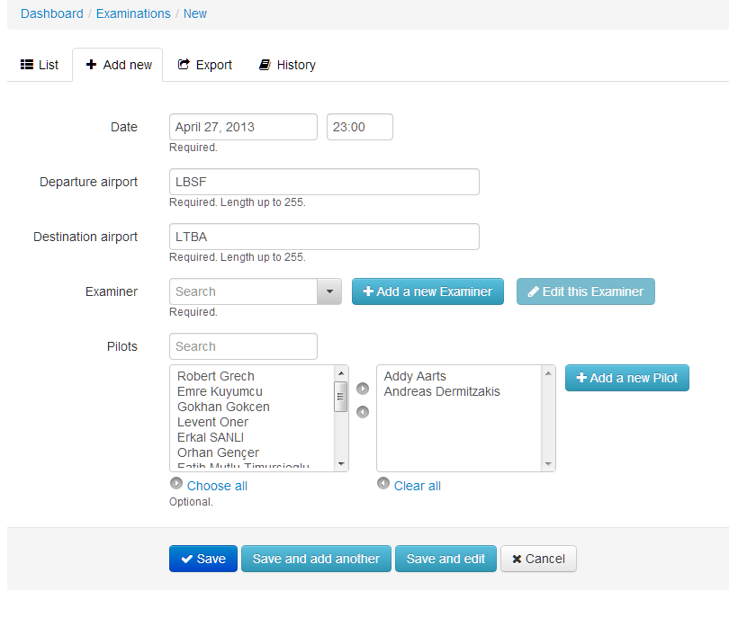
* __Export__  tab: allows exporting all or selected individual records of the relevant type to csv, xml or json formats.
  (See the "Data liberation" section below). Below is an example of the "Export examiners" tab:  
  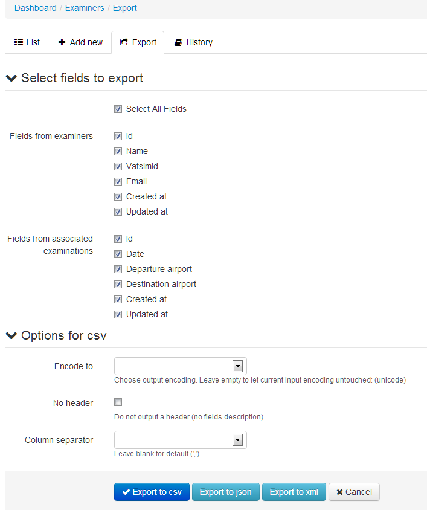
* __History__ tab: it displays a chronology of all "write" actions for the relevant record type (create, edit, delete),
  plus the details of the action (what was changed) and the backend user who changed it. Also see the "History Log" section below.
  Below is a "History" snippet:  
  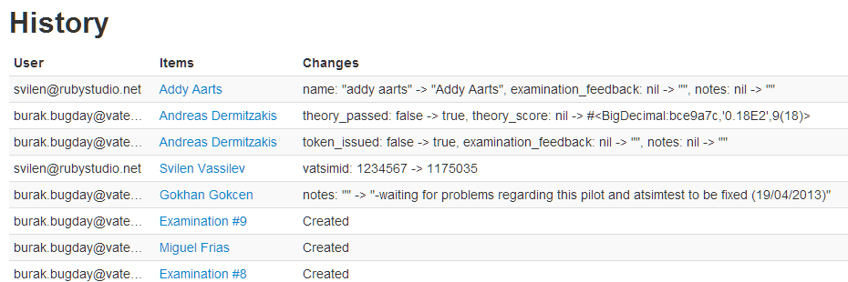
* __Filter / Search__ functionality: allows searching (filtering) the records by single or multiple criteria.
  The "Quick Filter" field will try to match the entered text against the data of *any* record field. Individual fields
  can be selected via the "Add filter" dropdown menu on the right. Below is an example of pilot records filtered by their
  desired pilot rank and division:  
  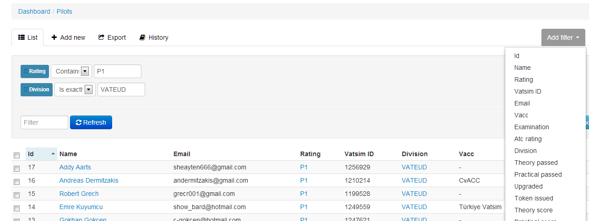

For each __individual record__ there are several individual actions, accessible via the minibuttons in the list/index view.
Below is a shot of the minibuttons linked to different actions:

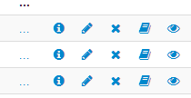

* __Show__ action: presents the details for the selected record. Below is an example of an
  examination "show" view:  
  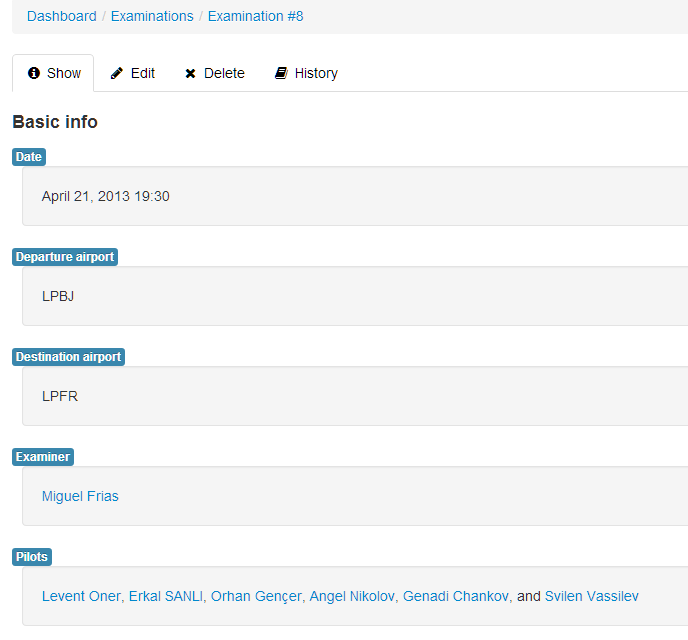
* __Edit__ action: a form (with possible nested forms) to edit the record details.
  Below is part of a pilot "edit" view:  
  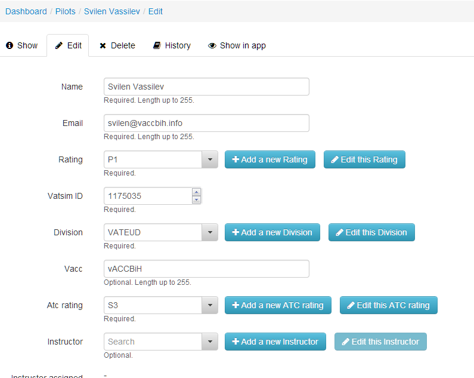
* __Delete__ action: allows deleting of a selected record:  
  
* __History__: the historical log of the record (see the "History Log" section below)

### Record groups
The record types are split in 2 groups: __administrative__ records and __operational__ records. The administrative records are not accessible to examiners, instructors and other non-admin managers, as they seldom require editing and define the general behaviour and available options of the application. 

### Administrative Records
* ATC ratings: a listing of all available VATSIM ATC ratings, to be used in forms and pulldown menus
* Divisions: a list of the divisions that are allowed to conduct their pilot training via the VATEUD ATO, to be used in forms and pulldown menus
* Ratings: a list of all pilot ratings that the VATEUD ATO is certified to provide training for
* Users: the user management panel for authorized backend users. Only accessible by the app admins.
 
### Operational Records

#### Examiners
Examiner records are created manually by the app administrators.

_The following data is stored and can be manipulated for each record:_

* Name
* VATSIM ID
* Email

_Data available by association, and listed on each examiner's "show" page:_

* Examinations

#### Instructors
Instructor records are created manually by the app administrators.

_The following data is stored and can be manipulated for each record:_

* Name
* VATSIM ID
* Email

_Data available by association, and listed on each instructor's "show" page:_

* Pilots
* Trainings

#### Pilots
Pilot (trainee) records are normally created automatically when a trainee submits the
"Enroll" form from the frontend. It's also possible to create pilots manually via the
backend.

_The following data is stored and can be manipulated for each record:_

* Name
* Email
* VATSIM ID
* Desired pilot rating
* Division
* VACC
* ATC rating
* Instructor
* Instructor assigned date/time
* Token issued
* Token issued date/time
* Token reissued
* Token reissued date/time
* Theory passed
* Theory passed date/time
* Theory score
* Examination
* Practical passed
* Practical passed date/time
* Practical score
* Examination feedback
* Upgraded
* Upgraded date/tme
* Notes

Some of this data is __automatically collected__ and stored by the app without manual input. See
the "Chronography automation" section below.

Changing some of this data triggers __email notifications__. See "Email automation" section below.

Note that upon editing a pilot record to assign or re-assign him to an examination, only the upcoming (future) examinations will be available in the list, the past ones are not on the list.

_Data available by association, and listed on each pilot's "show" page:_

* Trainings

#### Examinations
Examination records are created (scheduled) manually by the app administrators or by examiners.

_The following data is stored and can be manipulated for each record:_

* Date / Time
* Departure airport
* Destination airport
* Examiner
* Participating pilot(s)

Note that when creating or editing an examination only the trainees who haven't been examined yet will be
available for inclusion.

Changing some of this data triggers __email notifications__. See "Email automation" section below.

#### Trainings
Training records are created (scheduled) manually by the app administrators or by instructors.

_The following data is stored and can be manipulated for each record:_

* Date / Time
* Departure airport
* Destination airport
* Instructor
* Participating pilot(s)

Note that when creating or editing a training only the trainees who haven't been upgraded yet will be
available for inclusion.

Changing some of this data triggers __email notifications__. See "Email automation" section below.

## Email automation

Emails are automatically being sent by the app in the following cases to the following recipients:

### Upon pilot registration/enrollment

* When a pilot has *enrolled* for training by filling the form at http://ptd.vateud.net __OR__
* When a pilot record has been manually *created* on the backend by an administrator:
* A welcome email is sent *to the pilot* with his record details and general training instructions
* A notification email is sent *to all admin users* of the app, advising that a new pilot
  has enrolled for training and listing the pilot's details

### Upon assigning an instructor to a pilot
* When a pilot record is edited to *assign/reassign an instructor* to a pilot:
* A notification email is sent *to the pilot*, advising him an instructor has been assigned for
  his training and providing the instructors details: name, VATSIM id, email
* A notification email is sent *to the instructor*, advising them they have been assigned
  a new pilot trainee and providing all the pilot details: name, id, email, requested rating,
  division, vacc, atc rating, etc.

### Upon scheduling a training session
* When a new training session record is created and/or when an training date gets changed:
* A notification email is sent *to the instructor* assigned for the training, providing
  the necessary details: date, time, arrival and departure airports and participating pilot(s), additional notes
* A notification email is sent *to all pilots* involved in the training with all the
  aforementioned details

### Upon issuing or re-issuing an exam token
* When a pilot's record is marked with the "Token issued" or "Token re-issued" check-mark:
* A notification email is sent *to the pilot*, advising them they can now sit their theoretical
  test and giving them instructions on how to access and log into the test system (currently ATSimTest)

### Upon passing the theoretical exam

* When a pilot's record is edited to acknowledge the passing of a theoretical exam and his mark:
* A notification email is sent *to the pilot* informing him that he has passed and about his mark
* A notification email is sent *to the pilot's instructor* informing him that his trainee
  has passed the test and about his mark

### Upon scheduling an examination
* When a new examination record is created and/or when an examination date gets changed:
* A notification email is sent *to the examiner* assigned for the examination, providing
  the necessary details: date, time, arrival and departure airports and participating pilot(s)
* A notification email is sent *to all pilots* involved in the examination with all the
  aforementioned details
* A notification email is sent *to the instructor(s)* of all pilots involved in the examination
  with the aforementioned details

### Upon passing the practical exam
* When a pilot's record is edited to acknowledge the passing of a practical exam and his mark:
* A notification email is sent *to the pilot* informing him that he has passed and about his mark
* A notification email is sent *to the pilot's instructor* informing him that his trainee
  has passed the examination and about his mark  

### Upon submitting a practical examination feedback
* When a pilot's record is edited to add practical examination feedback by the pilot's examiner:
* A notification email is sent *to the pilot* informing him of the received feedback and its contents
* A notification email is sent *to the pilot's instructor* informing him that his trainee
  has received examination feedback and its contents

### Upon upgrading
* When a pilot's record is edited to mark him as an "upgraded"
* A notification email is sent *to the pilot* informing him of the rating upgrade

__Overall, over the life-cycle of a single pilot training 17 different emails are being sent by the
application to different recipients__

### Technical details regarding the emails
* All emails sent by the app are multipart consisting of html and txt parts to satisfy both
  email clients that use or don't use html

## Chronography automation  

The __dates and times__ for the following events, related to the pilot records, are captured
automatically without manual input and are available for reference and housekeeping:

* Pilot enrollment
* Instructor assigned
* Exam token issued
* Exam token re-issued
* Theoretical exam passed
* Practical exam passed
* Upgraded
* Last update of the pilot record (on any change)

### History Log

Each "write" action to the database (creation, update, deletion) for any type of record (pilots, instructors,
examiners, examinations) is __logged__ together with the user who made the change, the date and time
and the details of the change.

## Data liberation

All records and record types can be either completely or selectively __exported__ via the
backend interface by any PTD admin to any of the following formats: csv, xml, json.
**Note:** this is __not__ a public API.

## Frontend

All frontend pages update dynamically without manual input.

### Enrollment form
New pilots sign up for training by filling in and submitting the
enroll form at [http://ptd.vateud.net/](http://ptd.vateud.net/).   
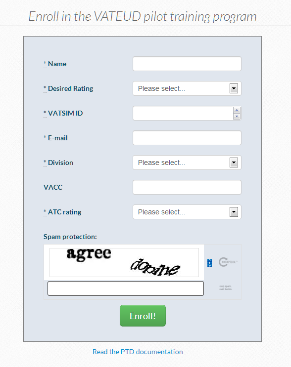

### Pilot records
Each pilot is limited to only check their own record and history, by using a unique, non-reversible URL.
This URL is initially emailed to the pilot with the welcome email after enrolling, and subsequently 
included in each notification email for the lifecycle of the training (see "Email Automation" section).   

### Frontend data tables
Abridged data listings are published on the frontend in reverse chronological order for the
following data types: pilot trainees, examinations, trainings, PTD staff. Below is a snippet of the pilot's
table (the links point to each pilot's __vataware__ page):   
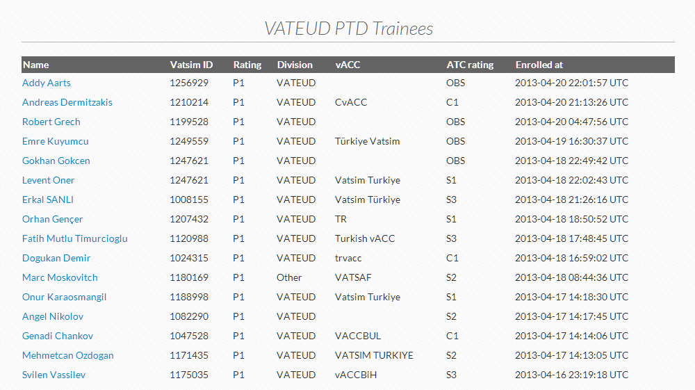

### Statistics
The "Statistics" page shows activity charts (monthly and yearly) depicting the dynamics of trainee records,
examinations and trainings. Some numbers are also published: total pilots enrolled, pilots that have passed theory,
pilot's that have passed practical exam, upgraded pilots, total numbers of examinations and tranings, etc    
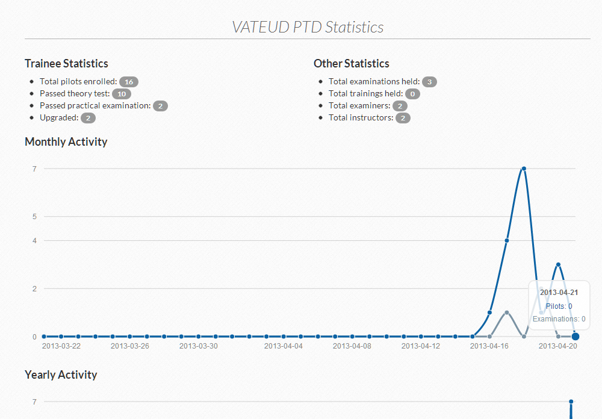
